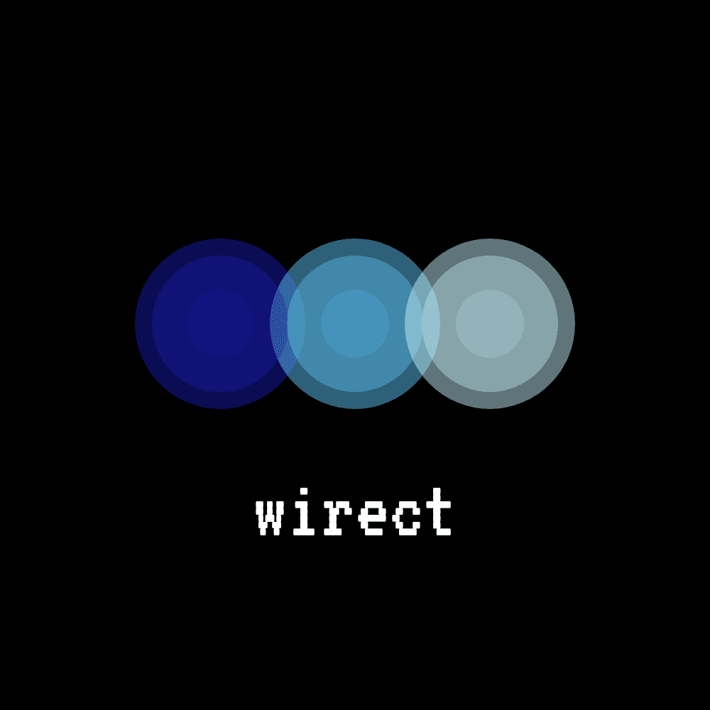

<h1 align="center">Wirect</h1>

  

# Wirect ESP8266 WifiSniffer

**VERY IMPORTANT:** *This code is only for educational purposes. We don’t want to listen for any private communication and we don't do it. All packets that you can listen with this code are public packets without any encryption or secure layer on it, continuously broadcasted to the air by smartphones. Please, check which country's laws applies to you before use this code.

## Code  

This repository uses [Platformio](http://platformio.org/platformio-ide) to compile and upload code to ESP8266 but you can also use it with [Arduino IDE](https://github.com/esp8266/Arduino#installing-with-boards-manager).

I use one [nodeMCU devkit](https://github.com/nodemcu/nodemcu-devkit) because is a fast and easy way to program the chip because it includes serial to usb converter and breadboard compatibility but there are [many flavors](http://www.esp8266.com/wiki/doku.php?id=esp8266-module-family) available.

